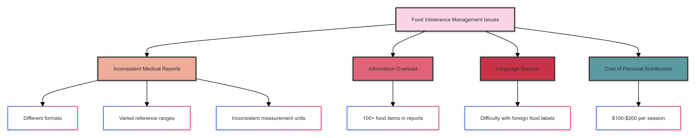
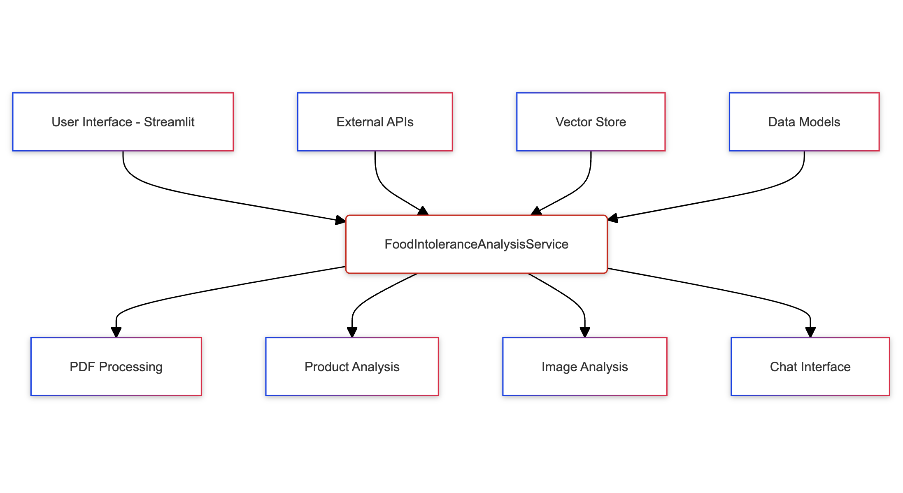

# Cracking the Code of Food Intolerance Reports with AI

## From Idea to Innovation: The Technical Journey of Health Cleo

## Day 1: The Spark on Jeju Island

It all started on a bustling street in Jeju, South Korea. I stood there, overwhelmed by the vibrant array of street food, but paralyzed by uncertainty. As someone with multiple food intolerances, I found myself in a familiar predicament: how could I safely navigate this culinary paradise without risking my health?

 

I pulled out my food intolerance report, a crumpled piece of paper filled with numbers and medical jargon. As I squinted at the tiny print, trying to remember which foods were safe and which weren't, a thought struck me: why isn't there an app for this?


**Note: Streamlit Demo video attached below** 

**[Click Here To See Streamlit App Demo](#running-streamlit-demo)**

****

## Day 2: Research and Problem Definition

Back home, I dove into research. I discovered I wasn't alone in my struggles:

1. **Inconsistent Medical Reports**: Each lab uses different formats, reference ranges, and measurement units.
2. **Information Overload**: The average food intolerance report contains data on 100+ food items.
3. **Language Barriers**: For travelers, deciphering foreign food labels adds another layer of complexity.
4. **Cost**: Personal nutritionists are expensive, costing an average of USD 100 - USD 200 per session.



The problem was clear: we needed a solution that could interpret varied medical reports, remember complex dietary restrictions, and provide real-time food safety advice.

## Day 3: Conceptualizing the Solution



I envisioned an AI-powered app that could:
1. Parse any food intolerance report
2. Create a personalized dietary profile
3. Analyze food products in real-time
4. Provide safe eating recommendations


But how to build it? I needed a powerful AI backbone that could handle complex language processing, image recognition, and data analysis. After evaluating various options, I discovered Upstage AI's suite of APIs. Their combination of document parsing, OCR, embedding, and language models seemed perfect for our needs.

## Day 4: Laying the Groundwork

With the concept clear and the tools chosen, it was time to start coding. I began by setting up the project structure and defining our data models using Pydantic:


```python
from pydantic import BaseModel
from typing import List, Dict

class ReferenceRange(BaseModel):
    elevated: str
    borderline: str
    normal: str

class FoodItem(BaseModel):
    name: str
    value: float
    category: str

class FoodIntoleranceReport(BaseModel):
    reference_range: ReferenceRange
    food_items: List[FoodItem]

class ProductAnalysis(BaseModel):
    product_name: str
    ingredients: List[str]
    suitability: Dict[str, str]
    overall_rating: str
    explanation: str
```

Using Pydantic not only ensured type safety but also served as self-documenting code, clearly defining the structure of our data.

## Day 5: Tackling Report Inconsistency

The first major challenge was parsing inconsistent medical reports. I leveraged Upstage's document parser and OCR capabilities, combined with custom HTML parsing and prompt engineering:


```python
def extract_tables_from_html(html_content: str) -> List[str]:
    soup = BeautifulSoup(html_content, 'html.parser')
    return [str(table) for table in soup.find_all('table')]

def parse_reference_range(text: str) -> ReferenceRange:
    elevated = re.search(r'Elevated[^\d]*(\d+(?:\.\d+)?)', text)
    borderline = re.search(r'Borderline[^\d]*(\d+(?:\.\d+)?)[^\d]*(\d+(?:\.\d+)?)', text)
    normal = re.search(r'Normal[^\d]*(\d+(?:\.\d+)?)', text)
    
    return ReferenceRange(
        elevated=f"> {elevated.group(1)} U/mL" if elevated else "",
        borderline=f"{borderline.group(1)}-{borderline.group(2)} U/mL" if borderline else "",
        normal=f"< {normal.group(1)} U/mL" if normal else ""
    )

def categorize_food_item(value: float, reference_range: ReferenceRange) -> str:
    elevated_threshold = float(re.search(r'\d+', reference_range.elevated).group())
    borderline_range = [float(x) for x in re.findall(r'\d+', reference_range.borderline)]
    
    if value >= elevated_threshold:
        return "Elevated"
    elif borderline_range[0] <= value <= borderline_range[1]:
        return "Borderline"
    else:
        return "Normal"

class FoodIntoleranceAnalysisService:
    def __init__(self, upstage_api_key: str, tavily_api_key: str):
        self.upstage_api_key = upstage_api_key
        self.tavily_api_key = tavily_api_key
        self.embeddings: Embeddings = UpstageEmbeddings(api_key=upstage_api_key, model="solar-embedding-1-large")
        self.llm: BaseLLM = ChatUpstage(api_key=upstage_api_key)
        self.translator: BaseLLM = ChatUpstage(api_key=upstage_api_key, model="solar-1-mini-translate-koen")
        self.groundedness_check = UpstageGroundednessCheck(api_key=upstage_api_key)
        self.vectorstore: VectorStore = None
        self.reference_range: ReferenceRange = None
        self.food_items: List[FoodItem] = []
        self.api = openfoodfacts.API(user_agent="FoodIntoleranceApp/1.0")
        self.tavily = TavilyClient(api_key=tavily_api_key)

        self.text_splitter = RecursiveCharacterTextSplitter(
            chunk_size=3000,
            chunk_overlap=200,
            length_function=self.llm.get_num_tokens
        )

    def stream(self, prompt: str):
        """
        Stream the response from the LLM for the chat interface.
        """
        messages = [HumanMessage(content=prompt)]
        return self.llm.stream(messages)

    def process_pdf(self, pdf_path: str) -> FoodIntoleranceReport:
        loader = UpstageLayoutAnalysisLoader(pdf_path, split="page", api_key=self.upstage_api_key, use_ocr=True, output_type="html")
        docs = loader.load()

        all_tables = []
        for doc in docs:
            tables = extract_tables_from_html(doc.page_content)
            all_tables.extend(tables)

        chunked_tables = self.text_splitter.split_text("\n".join(all_tables))
        table_docs = [Document(page_content=chunk) for chunk in chunked_tables]

        self.vectorstore = Chroma.from_documents(table_docs, self.embeddings)

        self.reference_range = self._extract_reference_range(chunked_tables)
        self.food_items = self._extract_food_items(chunked_tables)

        return FoodIntoleranceReport(reference_range=self.reference_range, food_items=self.food_items)
```

Let's break down the key components:

1. **HTML Parsing**: The `extract_tables_from_html` function uses BeautifulSoup to parse the HTML content and extract all table elements. This is crucial for handling the varied formats of medical reports.

2. **Reference Range Parsing**: The `parse_reference_range` function uses regular expressions to extract the elevated, borderline, and normal ranges from the text. This flexibility allows us to handle different reporting formats.

3. **Food Item Categorization**: The `categorize_food_item` function determines whether a food item's intolerance level is elevated, borderline, or normal based on the parsed reference range.

4. **PDF Processing**: The `process_pdf` function ties everything together. It uses Upstage's LayoutAnalysisLoader to convert the PDF to HTML, extracts tables, chunks the content, and stores it in a vector database for efficient querying.

Output:


## Day 6: Implementing Prompt Engineering and RetrievalQA

To extract meaningful information from the parsed reports, I implemented a sophisticated prompt engineering system using LangChain's PromptTemplate and RetrievalQA:


```python
def _extract_reference_range(self, tables: List[str]) -> ReferenceRange:
    reference_range_query = PromptTemplate(
        input_variables=["tables"],
        template="""
        Analyze the following table content and extract the reference range for Elevated, Borderline, and Normal food intolerance levels:

        {tables}

        Provide the results in the following format:
        Elevated: > X U/mL
        Borderline: Y-Z U/mL
        Normal: < W U/mL
        """
    )
    
    results = []
    for chunk in tables:
        result = self._query_vectorstore(reference_range_query.format(tables=chunk))
        results.append(result)

    combined_result = " ".join(results)
    return parse_reference_range(combined_result)

def _query_vectorstore(self, query: str) -> str:
    qa_chain = RetrievalQA.from_chain_type(
        llm=self.llm,
        chain_type="stuff",
        retriever=self.vectorstore.as_retriever(search_kwargs={"k": 3}),
    )
    return qa_chain.run(query)

def _check_ingredient_suitability(self, ingredients: List[str]) -> Dict[str, str]:
        suitability_query = PromptTemplate(
            input_variables=["ingredients", "food_items"],
            template="""
            Based on the following food intolerance data:
            {food_items}

            Analyze the suitability of these ingredients:
            {ingredients}

            For each ingredient, classify it as:
            - Suitable: if it's not in the list or has a "Normal" value
            - Caution: if it's in the list with a "Borderline" value
            - Avoid: if it's in the list with an "Elevated" value
            - Unknown: if there's not enough information

            Provide the result in the following format:
            Ingredient: Classification
            """
        )

        # Split ingredients into chunks if necessary
        ingredient_chunks = self.text_splitter.split_text(", ".join(ingredients))
        food_items_text = "\n".join([f"{item.name}: {item.value} U/mL - {item.category}" for item in self.food_items])

        all_suitability = {}
        for chunk in ingredient_chunks:
            result = self._query_vectorstore(suitability_query.format(
                ingredients=chunk,
                food_items=food_items_text
            ))
            chunk_suitability = self._parse_suitability_result(result)
            all_suitability.update(chunk_suitability)

        return all_suitability
```

Here's what's happening:

1. **Prompt Engineering**: The `PromptTemplate` in `_extract_reference_range` creates a structured query for the language model. This prompt engineering ensures that we get consistent, formatted responses regardless of the input variation.

2. **RetrievalQA**: The `_query_vectorstore` function sets up a RetrievalQA chain. This powerful feature combines the vector store (which contains our parsed report data) with the language model to answer complex queries about the report content.

3. **Chunked Processing**: We process the tables in chunks, allowing us to handle large reports efficiently while maintaining context.

This approach allows us to extract structured information from unstructured or semi-structured medical reports, a key innovation in dealing with the inconsistency problem.

## Day 6: Building the Product Analysis Pipeline

Next, I tackled the challenge of real-time product analysis. This required integrating multiple technologies:


```python
def analyze_product_from_image(self, image_path: str) -> ProductAnalysis:
    ocr_text = self.ocr_product_image(image_path)
    context = self.tavily.search(query=f"Find product name for any such product that carries similar texts and brand '{ocr_text}'")
    
    product_name_query = PromptTemplate(
        input_variables=["context"],
        template="Extract the most likely product name from the following context:\n\n{context}\n\nProduct Name:"
    ).format(context=context['results'][0]['content'])
    
    product_name = self._query_vectorstore(product_name_query)
    ingredients = self.get_product_ingredients(product_name)
    
    return self.analyze_product(product_name, ingredients)

def get_product_ingredients(self, product_name: str) -> List[str]:
        result = self.api.product.text_search(product_name, page=1, page_size=1)
        if result['products']:
            # Try to get the ingredients in English first
            ingredients_text = result['products'][0].get('ingredients_text_en', '')
            # If not found or empty, fall back to the default ingredients_text
            if not ingredients_text:
                ingredients_text = result['products'][0].get('ingredients_text', '')

            # Return the list of ingredients, split by comma and stripped of extra spaces
            return [ing.strip() for ing in ingredients_text.split(',') if ing.strip()]
        return []
```
**Output**


This pipeline combines OCR, web search, language model querying, and our custom analysis logic to provide instant, accurate product assessments. Since OCR doesn't have contextual knowledge we use Tavily API to find accurate product name. Then use Upstage LLM to return idea candidat as product name.

## Day 7: Ensuring Reliability with Groundedness Checks

To prevent AI hallucinations - a critical concern when dealing with health information - I implemented Upstage's groundedness check:

```python
def _generate_overall_rating(self, suitability: Dict[str, str]) -> Tuple[str, str]:
    # ... (previous code)

    groundedness_check = UpstageGroundednessCheck(api_key=self.upstage_api_key)
    request_input = {
        "context": suitability_text,
        "answer": explanation,
    }
    groundedness_response = groundedness_check.invoke(request_input)

    if groundedness_response == "notGrounded":
        explanation += " (Note: This explanation may not be fully grounded in the provided data.)"
    elif groundedness_response == "notSure":
        explanation += " (Note: The accuracy of this explanation could not be confirmed.)"

    return rating, explanation
```

This ensures that every piece of advice given is firmly rooted in factual data.

## Day 7: Adding Multilingual Support

To make Health Cleo truly global, I integrated Upstage's translation capabilities:

```python
def translate_to_korean(self, text: str) -> str:
        messages = [
            HumanMessage(content=text),
            AIMessage(content="모든 응답을 한국어로 번역 중")
        ]
        response = self.translator.invoke(messages)
        return response.content

    def display_results_in_korean(self, report: FoodIntoleranceReport, product_analysis: ProductAnalysis):
        # Translate reference range and food items
        ref_range_text = f"Reference Range: Elevated: {report.reference_range.elevated}, Borderline: {report.reference_range.borderline}, Normal: {report.reference_range.normal}"
        ref_range_korean = self.translate_to_korean(ref_range_text)
        # print(f"\n{ref_range_korean}")

        print(product_analysis)

        for item in report.food_items:
            item_text = f"{item.name}: {item.value} U/mL - {item.category}"
            item_korean = self.translate_to_korean(item_text)
            # print(item_korean)

        # Translate product analysis results
        product_name_korean = self.translate_to_korean(f"Product Analysis for {product_analysis.product_name}:")
        print(f"\n{product_name_korean}")

        ingredients_korean = self.translate_to_korean(f"Ingredients: {', '.join(product_analysis.ingredients)}")
        print(ingredients_korean)

        suitability_korean = "Suitability:\n"
        for ingredient, suitability in product_analysis.suitability.items():
            suitability_korean = self.translate_to_korean(f"  {ingredient}: {suitability}")
            suitability_korean = suitability_korean.replace('\n', '')  # Remove extra new lines
            suitability_korean = suitability_korean.strip()
            suitability_korean = suitability_korean if suitability_korean else "Unknown"
            suitability_korean = suitability_korean.strip()
            suitability_korean = f"  {ingredient}: {suitability_korean}"
            suitability_korean = self.translate_to_korean(suitability_korean)
            suitability_korean = suitability_korean.replace('\n', '')  # Remove extra new lines
            suitability_korean = suitability_korean.strip()
            suitability_korean = suitability_korean if suitability_korean else "Unknown"
            suitability_korean = suitability_korean.strip()
            suitability_korean = f"  {ingredient}: {suitability_korean}"
            suitability_korean = self.translate_to_korean(suitability_korean)
            print(suitability_korean)

        overall_rating_korean = self.translate_to_korean(f"Overall Rating: {product_analysis['overall_rating']}")
        explanation_korean = self.translate_to_korean(f"Explanation: {product_analysis['explanation']}")
        print(overall_rating_korean)
        print(explanation_korean)
```

This feature is particularly valuable for travelers dealing with food labels in foreign languages.

## Day 8: Optimization and Testing

The final weeks were spent optimizing performance and conducting thorough testing. I implemented efficient chunking strategies for handling large documents:

```python
self.text_splitter = RecursiveCharacterTextSplitter(
    chunk_size=3000,
    chunk_overlap=200,
    length_function=self.llm.get_num_tokens
)
```

This allows us to process large documents in manageable pieces while maintaining context.

## The Result: Health Cleo

After an intense week, Health Cleo was born. It's not just an app; it's a personal AI nutritionist that:

1. Understands any food intolerance report
2. Provides real-time product analysis
3. Offers multilingual support for global travelers
4. Ensures reliability through groundedness checks

But more than that, it's a testament to the power of innovative engineering combined with cutting-edge AI. By leveraging Upstage AI's suite of APIs and implementing clever software design patterns, we've created a solution that turns the complex world of food intolerances into manageable, actionable information.

## Running Streamlit demo


There is a run.sh script add you api keys and lauch the script in your terminal.

```bash
# make a new virtual env using python 3.11 (tested on MacOS 14.6.1)
# python3.11 -m venv .venv
# source .venv/bin/activate

# pip install -r requirements.txt

cd cleo

export UPSTAGE_API_KEY="upstage-api-key"
export TAVILY_API_KEY="tavily-api-key"

streamlit run service.py --server.port 8501 --server.address 0.0.0.0
```

## Looking Ahead

As I reflect on this journey, I'm excited about the future. There's so much more we can do:

1. Integration with wearable devices like Rabbit R1, Humane AI pin for real-time capture, search and query
2. Expansion of our food database to include more regional specialties
3. Development of AR features for in-store shopping assistance


Health Cleo is just the beginning. We're working on integrating with wearable devices and expanding our database to include more regional and cultural specialties. Increasing other lab tests like allergy reports, etc. Imagine walking through a grocery store, and with a glance at a product through your AR glasses, you receive instant feedback on whether the product is safe for you to consume.

Here's to the future of personalized nutrition, powered by AI and driven by human ingenuity!

#HealthCleo #AIForHealth #FoodSafety #UpstageAI #SoftwareEngineering


